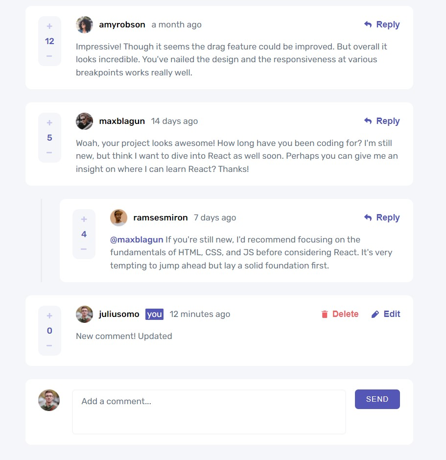

# Frontend Mentor - Interactive comments section solution

This is my solution to the [Interactive comments section challenge on Frontend Mentor](https://www.frontendmentor.io/challenges/interactive-comments-section-iG1RugEG9).

## Table of contents

- [Overview](#overview)
  - [The challenge](#the-challenge)
  - [Screenshot](#screenshot)
  - [Links](#links)
- [My process](#my-process)
  - [Built with](#built-with)
  - [What I learned](#what-i-learned)
  - [Continued development](#continued-development)
- [Author](#author)

**Note: Delete this note and update the table of contents based on what sections you keep.**

## Overview

### The challenge

Users should be able to:

- View the optimal layout for the app depending on their device's screen size
- See hover states for all interactive elements on the page
- Create, Read, Update, and Delete comments and replies
- Upvote and downvote comments
- **Bonus**: If you're building a purely front-end project, use `localStorage` to save the current state in the browser that persists when the browser is refreshed.
- **Bonus**: Instead of using the `createdAt` strings from the `data.json` file, try using timestamps and dynamically track the time since the comment or reply was posted.

### Screenshot

### Links

- Solution URL: [https://github.com/andy-devs/comment-section-challenge](https://github.com/andy-devs/comment-section-challenge)
- Live Site URL: [Add live site URL here](https://comment-section-challenge.vercel.app/)

## My process

### Built with

- HTML
- CSS Modules
- [React](https://reactjs.org/)
- [Redux](https://redux.js.org/)
- [Redux-toolkit](https://redux-toolkit.js.org/)
- [Moment.js](https://momentjs.com/)
- [Firebase](https://firebase.google.com/)
- [react-loader-spinner](https://www.npmjs.com/package/react-loader-spinner)

### What I learned

This project was a great challenge and big opportunity to practice React, Redux and how to work with Firebase. It was very fun!

### Continued development

I'm looking forward to do more projects with React and Redux.

## Author

- Website - [Andy Devs](https://andy-devs.github.io/)
- Frontend Mentor - [@andy-devs](https://www.frontendmentor.io/profile/andy-devs)
